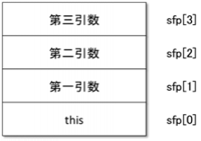

#Konoha 言語 外部ライブラリ バインディング チュートリアル

# はじめに
Konoha言語はスクリプト言語です。
スクリプト言語はグルー言語とも呼ばれ、様々な機能を組み合わせてプログラムを簡単に作成できることを、糊(グルー)で機能を貼り合わせることに比喩されて、そう呼ばれています。
他の言語と同様に、Konha言語からはC/C++などで開発されたライブラリを利用することができます。
C/C++ライブラリは、その長い開発期間や多くの利用を経て、安定かつ高速に動作するものが多く、現在でも積極的に利用されています。

本ドキュメント、Konohaパッケージ開発ガイドは、Konoha言語からこれらC/C++ライブラリを利用したい開発者に向けて、その具体的な方法を解説するものです。

Konohaでは、C/C++ライブラリを利用する為の簡単なグルー関数(バインド、ラッパーとも呼びます）を作成する必要があります。
この作業をバインディングと呼びます。
そして、複数のバインドをまとめたものをパッケージと呼び、利用者はパッケージ単位でC/C++ライブラリを利用することができます。 

本ドキュメントでは、複雑なバインディングの説明を簡単に行う為に、具体的なC/C++ライブラリのパッケージを紹介しながらKonohaでのパッケージ作成方法について説明を行っていきます。
本ドキュメントの構成は以下の通りです。 

[グルー関数の作成](#-3)では Lib.Libevent パッケージを題材に、基本的なパッケージの構築方法について学習します。
パッケージ作成の流れや、Konohaからの利用方法などについて述べています。

[Konoha スクリプトからパッケージをロードする際の内部動作](#konoha--6)では、パッケージがロードされる際の動作について、パッケージ作成に必要な情報をまとめました。

[Lib.Libevent パッケージでのオブジェクト指向の形態への変更について](#liblibevent-)では、Lib.Libevent パッケージでの実装の考え方について補足的に説明しました。

なお、本ドキュメントは以下のような方を対象にしています。

* C/C++言語での開発経験を持ち、サンプルコードを理解できる方
* Konoha言語の基本的な文法や、オブジェクト指向に関する知識のある方
* これからKonoha言語を使って、C/C++ライブラリを利用する必要がある方。

なお、本ドキュメントに対するフィードバックや質問はいつでも歓迎しております。
[Konoha開発者ML](https://groups.google.com/forum/?hl=ja&fromgroups#!aboutgroup/konoha-on-github)までご連絡ください。 

## 用語の説明
<table border=1 align=center class="inline">
	<tr class="row0" align=center>
		<th class="col0"> 用語 </th>
		<th class="col1"> 説明 </th>
	</tr>
	<tr>
		<td class="col0"> バインディング </td>
		<td class="col1"> 外部 C/C++ ライブラリを Konoha 言語から利用できるように Konoha パッケージを構築すること </td>
	</tr>
	<tr>
		<td class="col0"> ライブラリ関数 </td>
		<td class="col1"> 外部 C/C++ ライブラリの関数 </td>
	</tr>
	<tr>
		<td class="col0"> グルー関数 </td>
		<td class="col1"> Konoha 言語用グルー関数。Lib.Libevent パッケージでは Libevent_glue.c 内で定義されている。 C 言語の関数であるが、Konoha 言語からはメソッドとして呼ばれる。 「バインド」、「ラッパー」と呼ばれることもある。</td>
	</tr>
	<tr>
		<td class="col0"> Konoha メソッド </td>
		<td class="col1"> Konoha 言語のメソッド </td>
	</tr>
	<tr>
		<td class="col0"> Konoha オブジェクト </td>
		<td class="col1"> Konoha 言語のオブジェクト </td>
	</tr>
</table>

## 開発環境
具体的なバインディングの説明に入る前に、本ドキュメントでの開発環境について触れておきます。
まず、本ドキュメントでは"Konoha"と書いた場合、特に明記した場合をのぞいて、Konoha 3.0(2013.03現在の最新版)を意味します。
Konoha言語はバージョンごとにバインディングの方法が大きく異なりますので、ドキュメントを読み進める前にお使いのKonoha言語のバージョンを確認してください。

バージョンは、Konohaを起動すると確認できます。
起動画面の先頭にきているのが、Konohaのバージョンです。 下の例では "Konoha 3.0" がバージョン、"Rome" が開発コードになっています。

     % konoha
    Konoha 3.0 (Rome) (30e88dac, 66205, Feb 16 2013)
    [gcc 4.7.2]
    modules: MiniVM bmgengc iconv
    >>>

バインディングはグルー関数の作成が主な作業となります。
KonohaがC言語で記述されているため、グルー関数もC言語を用いて記述します。
Konohaはマルチプラットフォームで動作しますので、バインディングは各プラットフォームに対応するように行う必要があります。
そしてそれぞれのプラットフォームで用いるCコンパイラは異なります。
本ドキュメントはGNU/Linux, GCCでのバインディングを前提に解説しますが、この方法は以下のプラットフォームでもほぼ同じように動作します。 

<table border=1 align=center class="inline">
	<caption> プラットフォームと対応する開発環境 </caption>
	<tr class="row0">
		<th class="col0"><acronym title="Operating System">OS</acronym> </th>
		<th class="col1"> Compiler </th>
		<th class="col2"> version </th>
	</tr>
	<tr class="row1" align=center>
		<td class="col0"> Windows </td>
		<td class="col1"> mingw </td>
		<td class="col2"> 4.x  </td>
	</tr>
	<tr class="row2" align=center>
		<td class="col0"> MacOSX </td>
		<td class="col1"> gcc </td>
		<td class="col2"> 4.x </td>
	</tr>
	<tr class="row3" align=center>
		<td class="col0"> Linux </td>
		<td class="col1"> gcc </td>
		<td class="col2"> 4.x </td>
	</tr>
</table>

-----

# グルー関数の作成
ここでは Konoha 言語から [libevent](http://libevent.org/) を外部 C/C++ ライブラリとしてバインドしている Lib.Libevent パッケージを例として Konoha 言語にバインドする方法を実装例として示しながら説明していきます。

Lib.Libevent パッケージの作成にあたり、

* 移植性を保持するため、元の API に近いものとする

という方針で作成しています。
Konoha はオブジェクト指向言語であるためオブジェクト指向の形態に変更していますが、それ以外の引数は同じ形になるように作成しています(詳細は[Lib.Libevent パッケージでのオブジェクト指向の形態への変更について](#liblibevent-) をご覧ください)。

本チュートリアルに登場する例には行番号が振られていますが、github の konoha-project/konoha3 リポジトリ
>   [commit 66103b28762cede82a9844a7963c7d2727578b66](https://github.com/konoha-project/konoha3/tree/66103b28762cede82a9844a7963c7d2727578b66 "ベースソース")

のソースを使用しています。実際のソースを参照しながらこのチュートリアルを読み進める際には、 commit ID に注意してください。

## パッケージの構成ファイル
パッケージは、以下のファイルで構成されます。
<table border=1 align=center class="inline">
	<tr class="row0">
		<th class="col0"> ファイル名 </th>
		<th class="col1"> 説明 </th>
	</tr>
	<tr>
		<td class="col0"> パッケージ名_glue.c </td>
		<td class="col1"> cソースファイル、主にグルー関数が記述される。ファイル名は任意 </td>
	</tr>
	<tr>
		<td class="col0"> パッケージ名_glue.k </td>
		<td class="col1"> パッケージインターフェイススクリプト </td>
	</tr>
	<tr>
		<td class="col0"> パッケージ名_kick.k </td>
		<td class="col1"> パッケージスクリプト Lib.Libevent パッケージでは、Konoha 用ラッパークラスを定義しています。 </td>
	</tr>
	<tr>
		<td class="col0"> CMakeLists.txt </td>
		<td class="col1"> CMake 定義ファイル 詳細は CMake ドキュメントをご覧ください。 </td>
	</tr>
	<tr>
		<td class="col0"> パッケージ名_glue.so </td>
		<td class="col1"> パッケージ名_glue.c をコンパイルすることにより生成される共有ライブラリ </td>
	</tr>
</table>

(注) _Lib.Libevent_ パッケージの場合、 _「パッケージ名」_ は _"Libevent"_ となります。

このうち、Konoha からグルー関数を呼び出すために必要となるものは、共有ライブラリの パッケージ名_glue.so のみです。パッケージ名_glue.k および パッケージ名_kick.k は存在する場合読み込まれますが、定義などが不要であれば存在しなくても動作に影響はありません。

## クラスを定義する
Konoha はオブジェクト指向言語であるため、_libevent_ ライブラリ関数のバインドは _Lib.Libevent_ パッケージ内でクラスを定義し、各クラスにデータ構造(オブジェクト)とグルー関数を配置します。

### Konoha 言語の型と C 言語の型
C/C++ で Konoha 言語のメソッドを記述する場合、最も気を付けなければならない点は Konoha 言語と C 言語の間でのデータの受け渡しです。

Konoha 言語のプログラム記述には基本型として _boolean_ 型、 _int_ 型, _String_ 型, _Array_ 型などが利用できます。
また、 _Type.Float_ パッケージを利用することで _float_ 型の利用も可能となっています。

また、 Kohoha オブジェクトの受け渡しも必要となります。

Konoha メソッドとしてグルー関数が呼ばれた際には、C 言語の世界で Konoha メソッドの引数を取得しなければなりませんが、Konoha 言語の型と C 言語の型の橋渡しを行なうために、 _include/konoha3/konoha.h_ にて定義されているアクセス構造体 _struct KonohaValueVar_ のメンバー変数を経由してアクセスします。

166 - 170 行の "_sfp[0].asObject_" や "_sfp[2].intValue_" が実際のアクセス例となります。

    src/package-devel/Lib.Libevent_glue.c
    164  static KMETHOD cevent_new(KonohaContext *kctx, KonohaStack *sfp)
    165  {
    166          struct cevent *ev = (struct cevent *) sfp[0].asObject;
    167          struct cevent_base *cEvent_base = (struct cevent_base *)sfp[1].asObject;
    168          evutil_socket_t evd = (evutil_socket_t)sfp[2].intValue;
    169          short event = (short)(sfp[3].intValue & 0xffff);
    170          keventCBArg *cbArg = (keventCBArg *)sfp[4].asObject;    //deliver callback method
    171  
    172          ev->event = event_new(cEvent_base->event_base, evd, event, cevent_callback_1st, cbArg);
    173          KReturn(ev);
    174  }

_struct KonohaValueVar_ には様々な型、クラスに対応するためのメンバが用意されています。
用意されているメンバと対応する Konoha の型、クラスについては _include/konoha3/konoha.h_ で定義されている _struct KonohaValueVar_ を参照してください。

### グルー関数
ユーザースクリプトからグルー関数を経由して外部ライブラリを呼び出す場合、

1. ユーザーが作成した Konoha スクリプトから Konoha メソッドとして呼ぶ。
1. KonohaVM は登録されているクラス、メソッド名から対応するグルー関数を呼び出す。
1. 呼び出されたグルー関数は対応する C/C++ ライブラリ関数(本チュートリアルでは libevent のライブラリ関数)を呼び出す。

という流れになります。

呼び出されたグルー関数の内部では、以下のことを行います。

1. Konoha スタックからメソッドとして受け取った引数の取得
1. C/C++ 外部ライブラリ関数を呼び出し
1. 戻り値を C 言語の型から Konoha 言語のデータ型 へ変換し return する

それでは libevent ライブラリで定義されている _event_add()_ 関数を _cevent クラス_ の _event_add() メソッド_ としてバインドする例を示します。
_event_add()_ ライブラリ関数を呼び出すためのグルー関数 _cevent_event_add()_ の定義は以下のようになります。

    src/package-devel/Lib.Libevent_glue.c
    177  static KMETHOD cevent_event_add(KonohaContext *kctx, KonohaStack* sfp)
    178  {
    179          kcevent *kcev = (kcevent *)sfp[0].asObject;
    180          kctimeval *tv = (kctimeval *)sfp[1].asObject;
    181          int ret = event_add(kcev->event, (tv->timeval.tv_sec == 0 && tv->timeval.tv_usec == 0) ? NULL : &tv->timeval);
    182          KReturnUnboxValue(ret);
    183  }

177 行が _cevent_event_add()_ 関数のインタフェースとなりますが、グルー関数はすべて同じインタフェース (引数に _KonohaContext \*_ 型, _KonohaStack \*_ 型、戻り値が _KMETHOD_ の関数型)を持っています。

第一引数の _KonohaContext \*ctx_ には、Konoha コンテキストが渡されます。
第二引数の _KonohaStack \*sfp_ には、Konoha スタックが渡されます。
Konoha スタックは次の図のようになっています。

179, 180 行では Konoha VM が Konoha スタックに設定しているメソッドの引数(Konoha 言語の _Object_ 型) を参照するため C 言語の構造体ポインタ型に変換して保持しています。

181行目では、その Konoha オブジェクトのメンバを _event_add()_ の引数にして __ライブラリ関数を呼び出してます__ 。

182 行目では、ローカル変数 _ret_ をKonoha言語の _int_ 型として、VMに返すために _KReturn_ マクロを使用しています。
_KReturn_ マクロは _include/konoha3/konoha.h_ で定義されており、主に次を使用します。

<table border=1 align=center class="inline">
	<tr>
		<th class="col0"> マクロ </th>
		<th class="col1"> Konoha メソッドとしての戻り値の型 </th>
	</tr>
	<tr>
		<td class="col0"> KReturn(o) </td>
		<td class="col1"> オブジェクト </td>
	</tr>
	<tr>
		<td class="col0"> KReturnUnboxValue(d) </td>
		<td class="col1"> 基本型 </td>
	</tr>
	<tr>
		<td class="col0"> KReturnVoid() </td>
		<td class="col1"> void </td>
	</tr>
	<tr>
		<td class="col0"> KReturnFloatValue(c) </td>
		<td class="col1"> float型(受け取る側は Type.Float パッケージが必要) </td>
	</tr>
</table>

### 外部ライブラリのデータ構造をグルークラスへ割付ける
#### Konoha クラス構造体の定義
C バインドにおける Konoha クラス構造の定義(以下の例は cevent クラスの構造)は次のように行ないます。

    src/package-devel/Lib.Libevent_glue.c
    45  typedef struct cevent {
    46          kObjectHeader h;
    47          struct event *event;
    48  } kcevent;

_kObjectHeader h_ を構造体の先頭に配置し、以降に必要なメンバ変数を配置していきます。

_cevent クラス_ のメンバ変数 _event_ は Konoha 言語のオブジェクトから直接アクセスすることはできないため、必ずグルー関数を経由してのアクセスとなります。

#### Konoha の名前空間への登録
C における定義を Konoha クラスとして動作させるために、Konoha の名前空間への登録を行なう必要があります。

    src/package-devel/Lib.Libevent_glue.c
    517          // cevent
    518          KDEFINE_CLASS defcevent = {0};
    519          SETSTRUCTNAME(defcevent, cevent);
    520          defcevent.cflag     = KClassFlag_Final;
    521          defcevent.init      = cevent_Init;
    522  //      defcevent.reftrace  = cevent_Reftrace;
    523          defcevent.free      = cevent_Free;
    524          KClass *ceventClass = KLIB kNameSpace_DefineClass(kctx, ns, NULL, &defcevent, trace);

519 行の _SETSTRUCTNAME マクロ_ で _cevent クラス_ と _cevent 構造体_ の関連付けを行ないます。

520 行ではこのクラスの属性を指定しています。
_KClassFlag \*_  は _include/konoha3/konoha.h_ に定義されているので、そちらを参照してクラス属性を設定します。
521 - 523 行では、クラスとしての動作に必要となる以下の処理を行なう関数を設定しています。

* Konoha オブジェクト初期化関数(_defcevent.init_)
* Konoha オブジェクト参照トレース関数(_defcevent.reftrace_)
* Konoha オブジェクト解放関数(_defcevent.free_)

524 行で、 _KLIB kNameSpace_DefineClass()_ を呼ぶことにより、 _KDEFINE_CLASS defcevent_ の内容で Konoha クラス名前空間へ登録を行なっています。

##### Konoha オブジェクト初期化関数
521 行は、cevent クラスの初期化関数 _cevent_Init()_ を指定しています。

クラス初期化関数は、次の場合に呼び出されます。

* パッケージがロードされた際、各クラスの _NULL オブジェクト_ を生成する。
* コンストラクタ(_new_)が実行されるにあたり、先立ってオブジェクト初期化を行なう。

_cevent_Init()_ は 142 行から定義されていますが、第二引数の kObject ポインタを使用して、このオブジェクト( _this オブジェクト_ )のメンバを初期化します。

    src/package-devel/Lib.Libevent_glue.c
    142  static void cevent_Init(KonohaContext *kctx, kObject *o, void *conf)
    143  {
    144          struct cevent *ev = (struct cevent *) o;
    145          ev->event = NULL;
    146  }

また、 _eventCBArg クラス_ のようにメンバに _Konoha オブジェクト_ を保持する場合は、オブジェクトの変更を GC に通知するために __KFieldInit マクロ__ を使用して初期化を行ないます。
初期化以外の場合、オブジェクトへの参照を変更する際には __KFieldSet マクロ__ を使用します。

    src/package-devel/Lib.Libevent_glue.c
    346  static void eventCBArg_Init(KonohaContext *kctx, kObject *o, void *conf)
    347  {
    348          struct eventCBArg *cbarg = (struct eventCBArg *) o;
    349          cbarg->kctx = NULL;
    350          KFieldInit(cbarg, cbarg->kcb, K_NULL);
    351          KFieldInit(cbarg, cbarg->arg, K_NULL);
    352  }

##### Konoha オブジェクト参照トレース関数
522 行は _cevent クラス_ では不要なためコメントアウトされていますが、GC の参照トレースに対する応答が必要なメンバ( _Konoha オブジェクト_ )を持つ場合は必要となります。

例えば _eventCBArg クラス_ では次のように定義しています。

    src/package-devel/Lib.Libevent_glue.c
    363  static void eventCBArg_Reftrace(KonohaContext *kctx, kObject *o, KObjectVisitor *visitor)
    364  {
    365          struct eventCBArg *cba = (struct eventCBArg *) o;
    366          KRefTrace(cba->kcb);
    367          KRefTrace(cba->arg);
    368  }

_KRefTrace マクロ_ は、メンバオブジェクトが _NULL ポインタ_ を許容しない場合に使用します(Init関数における初期化で _NULLオブジェクト_ を設定している場合)。
_NULL ポインタ_ を許容している場合は、 _KRefTraceNullable マクロ_ を使用します。

##### Konoha オブジェクト解放関数
523 行は _cevent クラス_ のオブジェクトが解放される時に呼ばれる _cevent_Free() 関数_ を指定しています。

_cevent クラス_ ではオブジェクト解放にあたり libevent の _event_free()_ を実行する必要があるので、153 行で呼び出しています。

    src/package-devel/Lib.Libevent_glue.c
    148  static void cevent_Free(KonohaContext *kctx, kObject *o)
    149  {
    150          struct cevent *ev = (struct cevent *) o;
    151
    152          if(ev->event != NULL) {
    153                  event_free(ev->event);
    154                  ev->event = NULL;
    155          }
    156  }

####メンバ変数へのアクセス
次の例は _cevent クラス_ のコンストラクタでのメンバ変数へのアクセス例ですが、一般のメソッドでもアクセス方法は同じです。

    src/package-devel/Lib.Libevent_glue.c
    164  static KMETHOD cevent_new(KonohaContext *kctx, KonohaStack *sfp)
    165  {
    166          struct cevent *ev = (struct cevent *) sfp[0].asObject;
    167          struct cevent_base *cEvent_base = (struct cevent_base *)sfp[1].asObject;
    168          evutil_socket_t evd = (evutil_socket_t)sfp[2].intValue;
    169          short event = (short)(sfp[3].intValue & 0xffff);
    170          keventCBArg *cbArg = (keventCBArg *)sfp[4].asObject;    //deliver callback method
    171
    172          ev->event = event_new(cEvent_base->event_base, evd, event, cevent_callback_1st, cbArg);
    173          KReturn(ev);
    174  }

166 行で _this オブジェクト_ の参照を、 _オブジェクト構造体ポインタ ev_ に取得しています。

このコンストラクタの目的は、event_new の結果を ev->event に保存することなので、それを 172 行で行なっています。

そして、 _this オブジェクト_ を 173 行で戻り値として返します。

#### Konoha言語へのメソッドとしての登録
先ほど示したグルー関数は C の世界で定義された関数です。
Konoha 言語でメソッドとして利用可能にするためには、メソッドとしての引数、戻り値の情報とグルー関数の対応を登録する必要があります。

グルー関数の Konoha への登録は _Libevent_PackupNameSpace()_ 関数にて行われます。

※ _Libevent_PackupNameSpace()_ の詳細は後述する [Konoha スクリプトからパッケージをロードする際の内部動作](#konoha--6)にて説明します。

    src/package-devel/Lib.Libevent_glue.c
    505  static kbool_t Libevent_PackupNameSpace(KonohaContext *kctx, kNameSpace *ns, int option, KTraceInfo *trace)
    506  {
    
    (snip)
    
    570          int KType_cevent = ceventClass->typeId;
    
    (snip)
    
    591          KDEFINE_METHOD MethodData[] = {
    
    (snip)
    
    600                  _Public, _F(cevent_new), KType_cevent, KType_cevent, KMethodName_("new"), 4, KType_cevent_base, KFieldName_("cevent_base"), KType_Int, KFieldName_("evd"), KType_Int, KFieldName_("event"), KType_eventCBArg, KFieldName_("CBarg"),
    601                  _Public, _F(cevent_event_add), KType_Int, KType_cevent, KMethodName_("event_add"), 1, KType_ctimeval, KFieldName_("timeval"),
    
    (snip)
    
    626                  DEND, /* <= sentinel */
    627          };
    628          KLIB kNameSpace_LoadMethodData(kctx, ns, MethodData, trace);
    
    (snip)
    
    661
    662          return true;
    663  }

Konohaメソッドを登録するデータ構造 _KDEFINE_METHOD_ _MethodData[]_ は以下のフォーマットとなります。

* アノテーション , グルー関数のアドレス , 戻り値の型 , Thisの型 , メソッド名 , メソッドの引数の数, 第1引数の型, 第1引数の型, 第2引数の型, 第2引数の型, ...

_KLIB kNameSpace_LoadMethodData()_ では、 _MethodData[]_ 中の "メソッドの引数の数" に従って、次のグルー関数の "アノテーション" から始まる定義を識別するので、 "メソッドの引数の数" を間違えた場合正しく読み取れず、大抵の場合はパッケージをロードした段階で "Segmentation Fault" となります。

600 行で _cevent コンストラクタ_ を、601行で _event_add() メソッド_ をそれぞれ次の Konoha での宣言に対応するように定義しています。

    @Public cevent cevent(cevent_base, int, int, eventCBArg);
    @Public cevent event_add(ctimeval);

_KDEFINE_METHOD MethodData[]_ の最後の要素には、626 行のように終端データとして _DEND_ を指定します。

最後に _kNameSpace_LoadMethodData()_ によりメソッドの定義リストを NameSpace に登録することでメソッドの呼び出しが可能となります。

メソッドには0個以上のアノテーションを付与します。今回の場合、 _@Public_ のアノテーションを付与しています。

メソッドに付与可能なアノテーションは以下のとおりです。

<table border=1 align=center class="inline">
	<tr>
		<th class="col0"> フラグ名 </th>
		<th class="col1"> Konoha アノテーション </th>
		<th class="col2"> 説明 </th>
	</tr>
	<tr>
		<td class="col0"> _Public </td>
		<td class="col1"> @Public </td>
		<td class="col2"> クラス外部からのアクセスを許可する </td>
	</tr>
	<tr>
		<td class="col0"> _Private </td>
		<td class="col1"> @Private </td>
		<td class="col2"> クラス外部からのアクセスを禁止する </td>
	</tr>
	<tr>
		<td class="col0"> _Final </td>
		<td class="col1"> @Final </td>
		<td class="col2"> オーバーライド禁止 </td>
	</tr>
	<tr>
		<td class="col0"> _Const </td>
		<td class="col1"> @Const </td>
		<td class="col2"> 引数が同じ場合，同じ物を返す </td>
	</tr>
	<tr>
		<td class="col0"> _Static </td>
		<td class="col1"> @Static </td>
		<td class="col2"> インスタンス化せずにメソッドを呼び出すことを許可する </td>
	</tr>
	<tr>
		<td class="col0"> _Im </td>
		<td class="col1"> @Immutable </td>
		<td class="col2"> thisが変化しない </td>
	</tr>
	<tr>
		<td class="col0"> _Coercion </td>
		<td class="col1"> @Coercion </td>
		<td class="col2"> 引数が自動的にキャストされる </td>
	</tr>
	<tr>
		<td class="col0"> _Hidden </td>
		<td class="col1"> @Hidden </td>
		<td class="col2"> 予約 </td>
	</tr>
	<tr>
		<td class="col0"> _Virtual </td>
		<td class="col1"> @Virtual </td>
		<td class="col2"> 予約 </td>
	</tr>
	<tr>
		<td class="col0"> _Ignored </td>
		<td class="col1"> @IgnoredOverride </td>
		<td class="col2"> 予約 </td>
	</tr>
</table>

### グルークラスの制約
グルークラスは

*  Final クラスとして定義しなければない

という制約があります。

この制約のため C で定義されたグルークラスを Konoha 言語のクラス定義に _extends_ を使用して直接的に継承することはできません。
継承したい場合には Libevent_kick.k における _event_base クラス_ 定義のようにラップするクラスを定義して、ユーザープログラムからはそれを継承します。

    src/package-devel/Lib.Libevent_kick.k
    32  class event_base {
    33          cevent_base cevbase;
    34          @Private Map/*TODO Map[event]*/ evMap;
    35
    36          event_base() {
    37                  cevbase = new cevent_base();
    38                  evMap = new Map();
    39          }
    40  
    41          @Public int event_dispatch() {
    42                  return cevbase.event_dispatch();
    43          }
    
    (snip)
    
    52  }

## コールバックメソッドの呼び出し
### コールバックメソッドの引数について(Generics)
libevent ではイベントの種類によりコールバック関数の引数が異なります。Konoha のコールバックメソッドもこれに対応するために、コールバックメソッドに引数を指定した _Func 型_ を定義します。

具体的には、コールバックメソッドの定義に _Func_ 型を使用し、その引数の型を _Generics_ で定義します。

    src/package-devel/Lib.Libevent_glue.c
    578          //eventCB_p
    579          kparamtype_t eventCB_p[] = {{KType_Int, 0}, {KType_Int, 0}, {KType_Object, 0}};
    580          KClass *ceventCBfunc = KLIB KClass_Generics(kctx, KClass_Func, KType_void, 3, eventCB_p);
    581          int KType_ceventCBfunc = ceventCBfunc->typeId;
    
    (snip)
    
    591          KDEFINE_METHOD MethodData[] = {
    
    (snip)
    

    614                  // eventCBArg
    615                  _Public, _F(eventCBArg_new), KType_eventCBArg, KType_eventCBArg, KMethodName_("new"), 2, KType_ceventCBfunc, KFieldName_("konoha_CB"), KType_Object, KFieldName_("CBarg"),

    
    (snip)
    
    627          };
    628          KLIB kNameSpace_LoadMethodData(kctx, ns, MethodData, trace);

579 - 581 が コールバック用 _Func_ 型の定義になります。

1. 579 行で _kparamtype_t eventCB_p[]_ の宣言により _Func_ 型の引数を定義しています。
先頭から、
_{第一引数, 第二引数, ...}_
となります。
1. 580 行で _KLIB KClass_Generics()_ を呼ぶことにより、 _Func_ の _Generics_ 型を Konoha のクラスとして登録しています。
_KLIB KClass_Generics()_ の引数は _(コンテキスト, クラス, 戻り値の型, 引数の数, 引数の定義テーブル)_ となります。
1. 581 行では、[Konoha言語への登録] で説明した _MethodData[]_ へ登録するための型情報を取得し、615 行でそれを使用しています。

以上により _eventCBArg_ クラスのコールバックメソッドの型は _Func[void, int, int, Object]_ として定義されます。

この例では _eventCBArg_ クラスのコンストラクタを定義していますが、呼び出しは次のようになります。

    src/package-devel/Lib.Libevent_kick.k
    60          event(event_base evbase, int evd, int evCat, Func[void, int, int, Object] cb, Object cbArg) {
    61                  cev = new cevent(evbase.cevbase, evd, evCat, new eventCBArg(cb, cbArg));
    62                  this.evBase = evbase;
    63          }

### libevent コールバックから Konoha コールバックメソッドの呼び出し
libevent コールバックは C の関数を呼び出します。libevent コールバックとして Konoha メソッドを直接指定できません。
そのため、

1. libevent の _event_dispatch()_ 等から C のコールバック関数が呼び出される
1. C コールバック関数から _ユーザー定義の Konoha メソッド_ を呼び出す

という二段階の手続きが必要となります。

#### グルー関数から Konoha メソッドの呼び出し手順
グルー関数から Konoha メソッドを呼び出すためには、準備として Konoha スタックを設定する必要があります。
libevent のコールバック関数である _cevent_callback_1st()_ から Konoha コールバックメソッドを呼び出す手順を例に説明していきます。

    src/package-devel/Lib.Libevent_glue.c

    122  static void cevent_callback_1st(evutil_socket_t evd, short event, void *arg) {
    123          keventCBArg *cbArg = arg;
    124          KonohaContext *kctx = cbArg->kctx;
    125
    126          BEGIN_UnusedStack(lsfp);
    127          KClass *returnType = kMethod_GetReturnType(cbArg->kcb->method);
    128          KUnsafeFieldSet(lsfp[0].asObject, K_NULL);
    129          lsfp[1].intValue = evd;
    130          lsfp[2].intValue = event;
    131          KUnsafeFieldSet(lsfp[3].asObject, (kObject *)cbArg->arg);
    132
    133          KStackSetFuncAll(lsfp, KLIB Knull(kctx, returnType), 0/*UL*/, cbArg->kcb, 3);
    134          KStackCall(lsfp);
    135          END_UnusedStack();
    136  }

126 行で _BEGIN_UnusedStack_ マクロにて、メソッド呼び出しのためのスタックの準備を行なっています。

128 - 130 行でスタックを設定しています。128 行は通常の konoha メソッド呼び出しでは this オブジェクトが設定されますが、この場合は NULL オブジェクトにより簡易設定しています。
呼び出す Konoha メソッドが this オブジェクトを使わない場合であれば、これで問題ありません。

そして 133 行の _KStackSetFuncAll_ マクロで呼び出しのためのスタック設定を完了し、134 行の _KStackCall_ マクロにて Konoha メソッドを呼び出します。

Konoha メソッドから戻ると(135 行) _END_UnusedStack_ マクロによりスタックを呼び出し前の状態に戻します。

#### Konoha コールバックメソッドへ渡す引数
libevent のコールバックは次のように定義されています。

    /usr/include/event2/event.h
    typedef void (*event_callback_fn)(evutil_socket_t, short, void *);

libevent コールバック関数の第三引数は、event_new() の際に指定したものが渡されます。
通常、libevent コールバック関数内では、この引数により行なうべき処理を判断します。

Konoha のコールバックメソッドでも同様にするため、libevent コールバック関数の引数には

* Konoha コールバックメソッド
* コールバックメソッドに渡す第三引数

をパックした eventCBArg クラスを定義して、それを渡すようにしています。

そして

1. 172 行 の _event_new()_ で、libevent コールバック関数として _cevent_callback_1st()_ を、コールバック引数として _keventCBArg *cbArg_ を設定
1. イベントに応じて libevent の _libevent_dispatch()_ 等から _cevent_callback_1st()_ が _cbArg_ を引数にコールバックされる。
1.  _cevent_callback_1st()_ 関数内の 131 行において _cbArg_ から[コールバックメソッドの引数を設定](#libevent--konoha-)して、Konoha のコールバックメソッドを呼び出す。

という手順で _Konoha コールバックメソッド_ へ引数を渡しています。

    src/package-devel/Lib.Libevent_glue.c
    122  static void cevent_callback_1st(evutil_socket_t evd, short event, void *arg) {
    123          keventCBArg *cbArg = arg;
    124          KonohaContext *kctx = cbArg->kctx;
    125
    126          BEGIN_UnusedStack(lsfp);
    127          KClass *returnType = kMethod_GetReturnType(cbArg->kcb->method);
    128          KUnsafeFieldSet(lsfp[0].asObject, K_NULL);
    129          lsfp[1].intValue = evd;
    130          lsfp[2].intValue = event;
    131          KUnsafeFieldSet(lsfp[3].asObject, (kObject *)cbArg->arg);
    132
    133          KStackSetFuncAll(lsfp, KLIB Knull(kctx, returnType), 0/*UL*/, cbArg->kcb, 3);
    134          KStackCall(lsfp);
    135          END_UnusedStack();
    136  }
    
    (snip)
    
    164  static KMETHOD cevent_new(KonohaContext *kctx, KonohaStack *sfp)
    165  {
    
    (snip)
    
    170          keventCBArg *cbArg = (keventCBArg *)sfp[4].asObject;    //deliver callback method
    171
    172          ev->event = event_new(cEvent_base->event_base, evd, event, cevent_callback_1st, cbArg);
    173          KReturn(ev);
    174  }

-----

# Konoha スクリプトからパッケージをロードする際の内部動作
## パッケージの場所を特定する
  現在のKonohaではパッケージのインストール場所として以下の3つのディレクトリを順に探索し、最初にインポートパッケージ名(今回は _Lib.Libevent_)ディレクトリがあった場所からライブラリをロードします。

1.  _$INSTALL_PREFIX/konoha/$VERSION/package/_
1.  _$HOME/.konoha/konoha/$VERSION/package/_
1.  _$KONOHA_HOME/package/_

なお、_$INSTALL_PREFIX_ はデフォルトでは _/usr/local_, _$VERSION_ は2013年3月現在0.3が入ります。
また、_$KONOHA_HOME_ は環境変数として _KONOHA_HOME_ を指定した場合、探索の対象となります。

## 拡張ライブラリを読み込む
  パッケージの場所が特定できたらKonohaは拡張ライブラリの探索を行います。
  ライブラリは _"パッケージ名_glue.so"_ (今回の例では _Libevent_glue.so_)という名前を想定しています。(なお、MacOSXの場合拡張子はdylibとなります)
  拡張ライブラリのロードには以下の手順を踏みます。
  まず、ライブラリを初期化するため _"パッケージ名"_Init_ 関数(今回の例では _Libevent_Init()_)を呼び出します。

  Konohaでは各パッケージはそれぞれ別々の名前空間で区切られており、パッケージ間で定義をimport, exportするための機構が用意されています。
パッケージに新たに定数などを定義する際には _Tutorial1_PackupNameSpace()_ 関数を利用します。多くのパッケージではメソッド定義や文法定義などを行います。
他のパッケージにシンボルを公開する場合には _Tutorial1_ExportNameSpace()_ 関数を利用します。定数定義などでこの関数を利用しています。

    src/package-devel/Lib.Libevent_glue.c
    670  KDEFINE_PACKAGE *Libevent_Init(void)
    671  {
    672      static KDEFINE_PACKAGE d = {0};
    673      KSetPackageName(d, "libevent2", "0.1");
    674      d.PackupNameSpace       = Libevent_PackupNameSpace;
    675      d.ExportNameSpace       = Libevent_ExportNameSpace;
    676      return &d;
    677  }

## パッケージスクリプトを読み込む
パッケージの読み込みの最終ステップはパッケージ側で定義されているスクリプトをロードすることです。
_"パッケージ名"_kick.k_ のスクリプトがロードされます。(今回の例では _Libevent_kick.k_)
拡張ライブラリ内でCで記述されたメソッドのラッパーメソッドなどはここに記述されます。

-----

# CMakeLists.txt の作成
Konoha は ビルドシステムとして cmake を使用しています。
このため Lib.Libevent パッケージの CMakeLists.txt を作成します。

    src/package-devel/Lib.Libevent/CMakeLists.txt
    1  cmake_minimum_required(VERSION 2.6)
    2  find_package(LibEvent)
    3  if(EVENT_FOUND)
    4          include_directories(${EVENT_INCLUDE_DIR})
    5          set(PACKAGE_EXTRA_LIBRARY ${EVENT_LIBRARIES})
    6          set(PACKAGE_SOURCE_CODE Libevent_glue.c)
    7          set(PACKAGE_SCRIPT_CODE Libevent_glue.k Libevent_kick.k)
    8          add_konoha_package(Lib.Libevent)
    9  endif()

2 行で libevent がインストールされているか検索し、情報を取得しています。
この検索動作の詳細は cmake/FindLibEvent.cmake において定義されています。
cmake/FindLibEvent.cmake についての詳細は cmake ドキュメントを参照してください。

6 - 7 行で C のソースファイルと、グルースクリプトファイルを指定し、8 行で Konoha package として追加します。

-----

# Lib.Libevent パッケージでのオブジェクト指向の形態への変更について
[グルー関数の作成](#-3) で少し触れた Konoha パッケージでのオブジェクト指向の形態への変更について簡単に説明します。

libevent の内部では、管理用構造体が数種類定義されており、オブジェクト(領域)を確保して使用しています。

_struct event_base_ 構造体を例にすると

    1     struct event_base *base = event_base_new();
    2
    3     ... something event setting ...
    4
    5     event_base_dispatch(base);

というようになります。

1行で _struct event_base_ オブジェクトを作成し、5行でそのオブジェクトを指定して  _event_base_dispatch()_ 関数を呼んでいます。

libevent では、管理オブジェクトを指定する場合、関数は第一引数に管理オブジェクトを取るよう設計されています。
C 言語で作成されていますが、基本構造としてはオブジェクト指向となっています。

一方、 Konoha はオブジェクト指向言語であり、同等な処理を記述する場合は次のような記述が自然です。

    1     event_base base = new event_base();
    2
    3     ... something event setting ...
    4
    5     base.event_dispatch();

1行で _new event_base()_ でオブジェクトを生成し、5行でそのオブジェクトに対して _event_dispatch()_ メソッドを呼んでいます。

このような実装の変換を行なうことにより Konoha スクリプトとしてはオブジェクト指向で記述できるように Lib.Libevent パッケージを実装しています。
